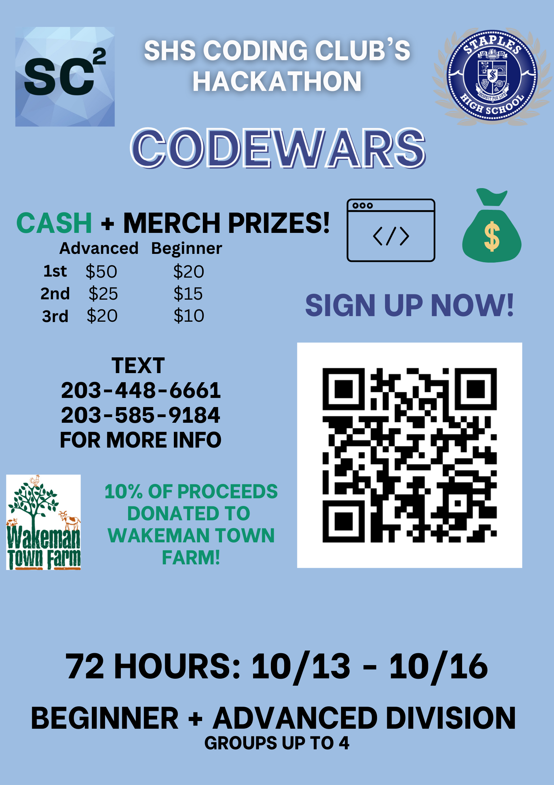

## Welcome to the Coding Club!

This year, the Coding Club is proud to present CodeWars, an annual hackathon started by Graham Zemel (SHS '24) and Perrin Root (SHS '25). The goal of CodeWars is to promote collaboration between Coding Club members to create the best projects possible. For more information, see the infographic below.

### Sponsors
2023-2024: Github, Major League Hacking  

### Yearly Themes
2023-2024: Education and Artificial Intelligence  

### Special Thanks
Dr. Nick Morgan  
- 2023-2024: Promoted on [drmorgan.org](http://drmorgan.org) & through Schoology announcements.

Mr. David Scrofani  
- 2023-2024: Promoted through Schoology announcements.  

SHS Library Media Center  
- 2023-2024: Promoted through displaying Coding Club media on TVs. 

[Sign Up Here!](https://forms.gle/ceTUrBq6KwNqFLUS8){: .btn .btn--inverse}
